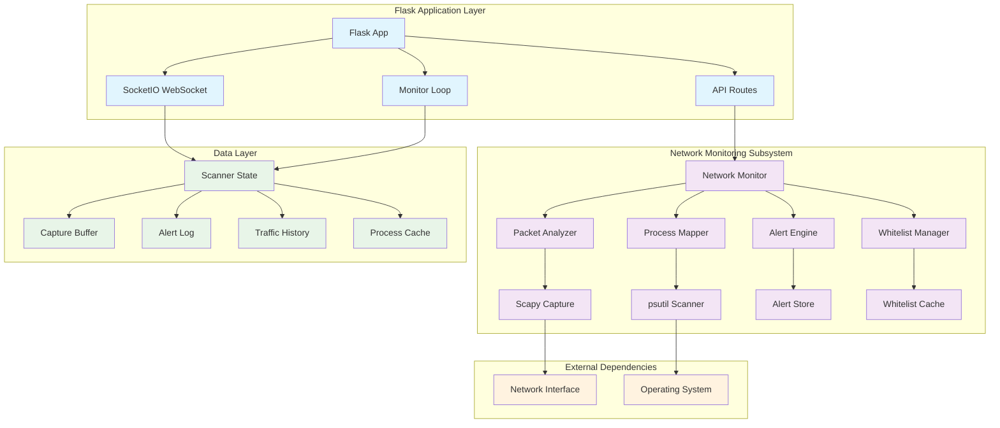
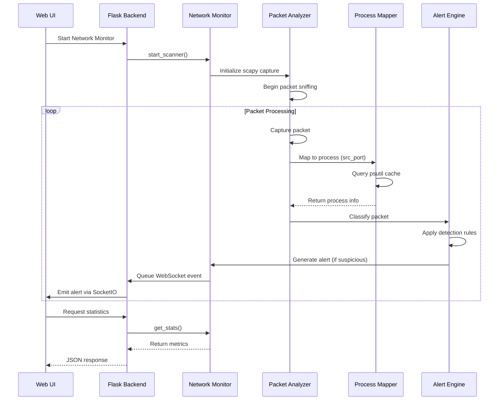

# Design Document: Network Monitoring Integration

## Overview

The Network Monitoring Integration feature enhances the existing NetShield AI Flask backend with comprehensive real-time network packet monitoring capabilities. This design integrates deep packet inspection using scapy with process mapping via psutil to provide behavior-aware network detection and response.

The system builds upon the existing Flask+SocketIO architecture, adding a threaded network monitoring subsystem that captures packets, correlates them with processes, detects suspicious activity, and provides real-time alerts through the existing web interface.

### Key Design Principles

- **Non-blocking Architecture**: Network monitoring runs in separate threads to avoid impacting the main Flask application
- **Graceful Degradation**: System continues operating even when packet capture fails or permissions are insufficient
- **Performance Optimization**: Caching and rolling buffers prevent memory bloat and minimize system impact
- **Extensible Detection**: Modular alert engine allows easy addition of new detection rules
- **Integration-First**: Leverages existing Flask routes, SocketIO connections, and alert management systems

## Architecture

### System Architecture Diagram



### Component Interaction Flow



## Components and Interfaces

### 1. Network Monitor (network_scanner.py)

**Primary Interface**: `ScannerState` class with thread-safe operations

```python
class ScannerState:
    def add_packet(self, packet_info: dict) -> None
    def add_suspicious(self, alert_info: dict) -> None
    def emit_event(self, event_type: str, data: dict) -> None
    def drain_events(self) -> List[dict]
    def compute_rate(self) -> Optional[dict]
    def get_stats(self) -> dict
    def reset(self) -> None
```

**Key Responsibilities**:
- Thread-safe state management for packet capture
- Rolling buffer management (500 packets, 200 alerts)
- Event queue for SocketIO emissions
- Performance metrics calculation

### 2. Packet Analyzer

**Interface**: Scapy callback function `_packet_callback(packet)`

```python
def _packet_callback(packet) -> None:
    """Process captured packets and extract network information"""
    
def classify_packet(proc_name: str, pid: int, dest_ip: str, 
                   dest_port: int, src_port: int, 
                   packet_size: int) -> Tuple[bool, List[str], str, int]:
    """Classify packet and return (is_suspicious, reasons, severity, trust_delta)"""
```

**Detection Rules**:
- Known malicious IP connections (Critical: -30 trust)
- Suspicious port usage (High: -15 trust)
- Non-whitelisted process activity (Medium: -10 trust)
- Large packet detection (Medium: -5 trust)
- Browser non-standard ports (Low: -5 trust)

### 3. Process Mapper

**Interface**: Port-to-process resolution with caching

```python
def get_process_from_port(local_port: int) -> Tuple[str, Optional[int]]:
    """Map local port to (process_name, pid) with TTL cache"""

def _refresh_port_cache() -> None:
    """Rebuild port-to-process mapping from psutil"""
```

**Caching Strategy**:
- 5-second TTL cache to minimize psutil calls
- Graceful handling of process termination
- Unknown process fallback for unresolvable connections

### 4. Alert Engine

**Interface**: Alert generation and management

```python
def generate_alert(proc_info: dict) -> dict:
    """Generate structured alert from process analysis"""

def max_severity(current: str, new: str) -> str:
    """Determine higher severity level"""
```

**Alert Structure**:
```python
{
    'id': 'PKT-{hash}',
    'timestamp': 'HH:MM:SS',
    'process': 'process_name',
    'pid': 12345,
    'dest_ip': '192.168.1.1',
    'dest_port': 443,
    'severity': 'Critical|High|Med|Low',
    'reasons': ['Connection to malicious IP'],
    'trust_delta': -30
}
```

### 5. Whitelist Manager

**Interface**: Whitelist and blocklist management

```python
# Built-in whitelists
WHITELIST_PROCS = {'chrome.exe', 'firefox.exe', 'svchost.exe', ...}
WHITELIST_IPS = {'127.0.0.1', '0.0.0.0', '::1', ...}
KNOWN_BAD_IPS = {'45.12.8.21', '185.220.101.1', ...}

# Runtime management
scanner_state.user_whitelist_procs: Set[str]
scanner_state.user_whitelist_ips: Set[str]
scanner_state.user_blocked_ips: Set[str]
```

### 6. Flask Integration Layer

**API Endpoints**:
```python
# Scanner control
POST /api/scanner/start    # Start packet capture
POST /api/scanner/stop     # Stop packet capture
POST /api/scanner/pause    # Pause processing
POST /api/scanner/resume   # Resume processing
POST /api/scanner/reset    # Reset all state

# Data retrieval
GET /api/scanner/status    # Current status and stats
GET /api/scanner/packets   # Recent captured packets
GET /api/scanner/alerts    # Suspicious packet alerts
GET /api/scanner/rate-history  # Traffic rate history

# Configuration
POST /api/scanner/whitelist  # Add to whitelist
POST /api/scanner/block      # Add to blocklist
```

**SocketIO Events**:
```python
# Emitted by scanner
'scanner_alert'     # New suspicious activity
'scanner_status'    # Status changes
'scanner_rate'      # Traffic rate updates
'scanner_error'     # Error notifications
```

## Data Models

### Packet Information Model

```python
PacketInfo = {
    'timestamp': str,        # 'HH:MM:SS.mmm'
    'src_ip': str,          # Source IP address
    'dest_ip': str,         # Destination IP address
    'src_port': int,        # Source port number
    'dest_port': int,       # Destination port number
    'protocol': str,        # 'TCP' | 'UDP'
    'flags': str,           # TCP flags (if applicable)
    'size': int,            # Packet size in bytes
    'process': str,         # Process name
    'pid': Optional[int]    # Process ID
}
```

### Alert Information Model

```python
AlertInfo = {
    'id': str,              # Unique alert ID 'PKT-{hash}'
    'timestamp': str,       # 'HH:MM:SS'
    'process': str,         # Process name
    'pid': Optional[int],   # Process ID
    'dest_ip': str,         # Destination IP
    'dest_port': int,       # Destination port
    'src_port': int,        # Source port
    'protocol': str,        # 'TCP' | 'UDP'
    'flags': str,           # TCP flags
    'size': int,            # Packet size
    'severity': str,        # 'Critical' | 'High' | 'Med' | 'Low'
    'reasons': List[str],   # List of detection reasons
    'trust_delta': int      # Trust score impact (negative)
}
```

### Traffic Rate Model

```python
TrafficRate = {
    'timestamp': str,       # ISO format timestamp
    'packets_per_sec': float,  # Calculated PPS rate
    'total_packets': int,   # Cumulative packet count
    'suspicious': int       # Cumulative suspicious count
}
```

### Scanner Statistics Model

```python
ScannerStats = {
    'running': bool,        # Scanner operational status
    'paused': bool,         # Processing paused status
    'total_packets': int,   # Total packets captured
    'suspicious_packets': int,  # Suspicious packets detected
    'blocked_count': int,   # Blocked connection attempts
    'uptime_seconds': int,  # Scanner uptime
    'top_destinations': List[{  # Top destination IPs
        'ip': str,
        'count': int
    }],
    'top_processes': List[{     # Top processes by packet count
        'process': str,
        'count': int
    }],
    'capture_buffer_size': int  # Current buffer utilization
}
```

## Correctness Properties

*A property is a characteristic or behavior that should hold true across all valid executions of a system-essentially, a formal statement about what the system should do. Properties serve as the bridge between human-readable specifications and machine-verifiable correctness guarantees.*

### Property 1: Packet Capture Completeness

*For any* TCP or UDP packet transmitted on a monitored network interface, the Packet_Analyzer SHALL capture and process the packet when the Network_Monitor is running.

**Validates: Requirements 1.1, 1.5**

### Property 2: Packet Field Extraction Accuracy

*For any* captured network packet, the Packet_Analyzer SHALL correctly extract all required fields (source IP, destination IP, source port, destination port, protocol, packet size) matching the original packet structure.

**Validates: Requirements 1.2**

### Property 3: Process Mapping Accuracy

*For any* network packet with a valid source port, the Process_Mapper SHALL either correctly identify the originating process or label it as "Unknown" without failing.

**Validates: Requirements 2.1, 2.4**

### Property 4: Process Information Completeness

*For any* successfully identified process, the Process_Mapper SHALL extract all required fields (process name, process ID, executable path, memory usage) with valid values.

**Validates: Requirements 2.2**

### Property 5: Cache TTL Behavior

*For any* port-to-process mapping in the cache, the mapping SHALL be refreshed after the 5-second TTL expires and SHALL be removed when the associated process terminates.

**Validates: Requirements 2.3, 2.5**

### Property 6: Malicious IP Alert Generation

*For any* network connection to a known malicious IP address, the Alert_Engine SHALL generate a Critical severity alert containing all required alert fields.

**Validates: Requirements 3.1, 5.1**

### Property 7: Suspicious Port Alert Generation

*For any* network traffic detected on suspicious ports (4444, 5555, 1337, 31337, 6667-6669, 8888, 9999, 12345), the Alert_Engine SHALL generate a High severity alert.

**Validates: Requirements 3.2**

### Property 8: Non-Whitelisted Process Alert Generation

*For any* network connection from a process not in the whitelist, the Alert_Engine SHALL generate a Medium severity alert unless the destination is a malicious IP (which takes precedence).

**Validates: Requirements 3.3**

### Property 9: Large Packet Detection

*For any* network packet exceeding 10KB in size, the Alert_Engine SHALL generate a Medium severity alert flagging potential data exfiltration.

**Validates: Requirements 3.4**

### Property 10: Browser Non-Standard Port Detection

*For any* browser process (chrome.exe, firefox.exe, msedge.exe) connecting to ports other than 80, 443, 8080, 8443, the Alert_Engine SHALL generate a Low severity alert.

**Validates: Requirements 3.5**

### Property 11: Trust Score Calculation Bounds

*For any* combination of detected anomalies, the Alert_Engine SHALL calculate trust scores within the range 0-100, where lower scores indicate higher risk levels.

**Validates: Requirements 3.6**

### Property 12: Whitelist Effectiveness

*For any* whitelisted process making connections to non-malicious IP addresses, the Alert_Engine SHALL NOT generate alerts for that activity.

**Validates: Requirements 4.4**

### Property 13: Dynamic Whitelist Management

*For any* valid process name or IP address added to the whitelist via API endpoints, the Whitelist_Manager SHALL immediately apply the whitelist entry to subsequent alert generation decisions.

**Validates: Requirements 4.2, 4.3, 9.2**

### Property 14: Alert Buffer Management

*For any* sequence of generated alerts, the Alert_Engine SHALL maintain a rolling buffer containing at most the 200 most recent alerts.

**Validates: Requirements 5.3**

### Property 15: Alert ID Uniqueness

*For any* set of alerts generated by the system, each alert SHALL have a unique ID to prevent duplicate processing.

**Validates: Requirements 5.4**

### Property 16: Severity-Based Remediation Actions

*For any* alert generated with a specific severity level, the Alert_Engine SHALL include appropriate remediation actions corresponding to that severity level.

**Validates: Requirements 5.5**

### Property 17: Alert Resolution

*For any* alert marked as resolved, the Alert_Engine SHALL remove it from the active alerts list and it SHALL NOT appear in subsequent alert queries.

**Validates: Requirements 5.6**

### Property 18: Network Statistics Accuracy

*For any* sequence of network events (packet captures, suspicious detections, blocked connections), the Network_Monitor SHALL maintain accurate counters reflecting the actual event counts.

**Validates: Requirements 6.1**

### Property 19: Traffic Rate Calculation

*For any* packet arrival pattern over time, the Network_Monitor SHALL calculate packets-per-second rates that accurately reflect the actual traffic volume within measurement intervals.

**Validates: Requirements 6.2**

### Property 20: Rolling History Management

*For any* extended monitoring period, the Network_Monitor SHALL maintain traffic rate history covering exactly the most recent 2-minute window.

**Validates: Requirements 6.3**

### Property 21: Top Destination and Process Tracking

*For any* traffic distribution across destinations and processes, the Network_Monitor SHALL accurately track and rank the top destinations and processes by packet count.

**Validates: Requirements 6.4**

### Property 22: API State Control

*For any* valid sequence of Network_Monitor control API calls (start, stop, pause, resume), the Flask_Backend SHALL correctly transition the monitor state according to the requested operations.

**Validates: Requirements 7.1**

### Property 23: Data Retrieval API Accuracy

*For any* system state containing captured packets, alerts, and statistics, the Flask_Backend data retrieval APIs SHALL return accurate representations of the current system data.

**Validates: Requirements 7.2**

### Property 24: Whitelist API Integration

*For any* valid whitelist or blocklist entry submitted via API endpoints, the Flask_Backend SHALL correctly update the Whitelist_Manager and the changes SHALL take effect immediately.

**Validates: Requirements 7.3**

### Property 25: SocketIO Event Emission

*For any* network monitoring event (alerts, statistics updates, status changes), the Flask_Backend SHALL emit corresponding SocketIO events to all connected clients.

**Validates: Requirements 7.4**

### Property 26: API Error Handling

*For any* Network_Monitor error condition, the Flask_Backend SHALL return appropriate HTTP status codes and error messages without crashing.

**Validates: Requirements 7.5**

### Property 27: Buffer Size Limits

*For any* system load condition, the Network_Monitor SHALL enforce maximum buffer sizes (500 packets, 200 alerts) by purging oldest entries when limits are exceeded.

**Validates: Requirements 8.1, 10.4**

### Property 28: Graceful Shutdown

*For any* application termination scenario, the Network_Monitor SHALL shut down cleanly without leaving hanging threads or resources.

**Validates: Requirements 8.3**

### Property 29: Error Resilience

*For any* network interface error or process retrieval failure, the Network_Monitor SHALL continue operating and processing other connections without terminating.

**Validates: Requirements 8.5, 10.2**

### Property 30: Configuration Validation

*For any* configuration input provided to the Network_Monitor, the system SHALL validate the input and reject invalid configurations with appropriate error messages.

**Validates: Requirements 9.5**

### Property 31: Health Check Accuracy

*For any* system operational state, the Network_Monitor health check endpoints SHALL accurately report the current operational status and key metrics.

**Validates: Requirements 10.5**

### Property 32: Critical Error Notification

*For any* critical error condition in the Network_Monitor, the system SHALL emit error events via WebSocket to notify administrators of the issue.

**Validates: Requirements 10.6**

## Error Handling

### Error Categories and Responses

#### 1. Permission and Access Errors
- **Scapy Installation Missing**: Return informative error message directing user to install scapy
- **Administrator Privileges Required**: Return descriptive error message indicating need for elevated privileges
- **Network Interface Access Denied**: Log error and continue in degraded mode

#### 2. Network Interface Errors
- **Invalid Interface Specification**: Validate interface names and return appropriate error messages
- **Interface Unavailable**: Attempt fallback to default interface or continue without packet capture
- **Capture Failure**: Implement automatic restart with 30-second delay

#### 3. Process Mapping Errors
- **Process Access Denied**: Label connection as "Unknown" and continue processing
- **Process Terminated**: Remove stale cache entries and handle gracefully
- **psutil Unavailable**: Continue with limited process information

#### 4. Memory and Resource Errors
- **Buffer Overflow**: Purge oldest entries to maintain operation within memory limits
- **High CPU Usage**: Implement backpressure mechanisms to throttle packet processing
- **Thread Exhaustion**: Queue events for processing when threads become available

#### 5. Configuration Errors
- **Invalid Whitelist Entries**: Validate and reject malformed process names or IP addresses
- **Malformed API Requests**: Return HTTP 400 with descriptive error messages
- **Missing Required Parameters**: Provide clear indication of required fields

### Error Recovery Strategies

#### Automatic Recovery
- **Packet Capture Restart**: Automatically restart scapy capture after failures with exponential backoff
- **Cache Refresh**: Rebuild process cache when corruption is detected
- **Buffer Cleanup**: Automatically purge old entries when memory pressure is detected

#### Graceful Degradation
- **Limited Process Information**: Continue monitoring with reduced process correlation when psutil fails
- **Reduced Alert Fidelity**: Generate basic alerts when advanced detection fails
- **Statistics-Only Mode**: Provide traffic statistics when full monitoring is unavailable

#### User Notification
- **WebSocket Error Events**: Emit real-time error notifications to connected administrators
- **API Error Responses**: Provide structured error information in API responses
- **Log Integration**: Write detailed error information to application logs

## Testing Strategy

### Dual Testing Approach

The network monitoring integration will use both unit tests and property-based tests to ensure comprehensive coverage:

**Unit Tests** will focus on:
- Specific error conditions and edge cases
- Integration points with Flask and SocketIO
- Mock-based testing of external dependencies (scapy, psutil)
- API endpoint functionality and error responses
- WebSocket event emission verification

**Property-Based Tests** will focus on:
- Universal properties that hold across all valid inputs
- Comprehensive input coverage through randomization
- Correctness guarantees for core monitoring logic
- Buffer management and resource limits
- Alert generation accuracy across various scenarios

### Property-Based Testing Configuration

- **Testing Library**: Hypothesis for Python property-based testing
- **Test Iterations**: Minimum 100 iterations per property test
- **Test Tagging**: Each property test tagged with format: **Feature: network-monitoring-integration, Property {number}: {property_text}**
- **Mock Strategy**: Use mocks for scapy and psutil to enable deterministic testing
- **Data Generation**: Custom generators for network packets, process information, and system states

### Integration Testing

- **Real Network Interface Testing**: Test with actual network interfaces where permissions allow
- **Performance Benchmarking**: Verify packet processing rates meet requirements
- **End-to-End Workflows**: Test complete monitoring workflows from packet capture to alert resolution
- **WebSocket Integration**: Verify real-time event emission to connected clients
- **API Integration**: Test all API endpoints with various system states

### Test Environment Requirements

- **Mock Network Interfaces**: Simulate various network interface conditions
- **Process Simulation**: Create test processes with known characteristics
- **Packet Generation**: Generate test packets with controlled properties
- **Permission Simulation**: Mock various permission and access scenarios
- **Load Testing**: Generate high packet volumes to test performance limits

The testing strategy ensures that the network monitoring integration maintains high reliability and performance while providing accurate threat detection capabilities.